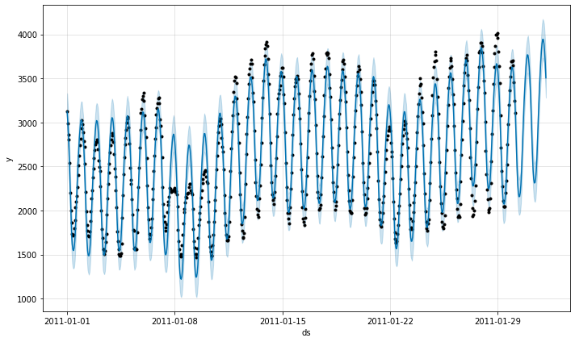
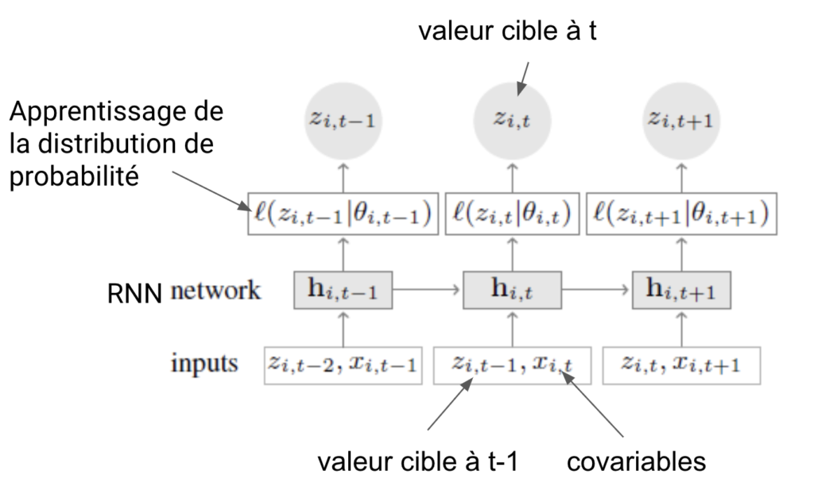
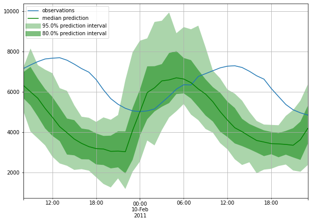

# Deep-Learning-Time-series

## Introduction
To illustrate the performance of Prophet and DeepAR, we have chosen an open-source dataset from the Kaggle "M4 Forecasting" competition. It contains a lot of different dataset, but we’ve chosen to focus only on hourly data to make it easier and to have shorter computation time. This dataset contains 414 time series (observed every hour). 
We compared 3 different algorithms: DeepAR, Prophet and SARIMA, a more classical statistical model. These three models were trained with time series observed over 960 hours. There performances were measured over 48 hours of prediction by the symmetric mean absolute percentage error (sMAPE). Until recently the statistical models were known to be unbeatable by any Machine Learning algorithms to create forecast of times series. However, with the rise of Nbeats, prophet and DEEP AR this time seems to be over

## 1.	SARIMA
SARIMA is a very well-known statistical model very efficient to model time Series. It has 3 parameters that need to be fitted to each of the times series. The first one corresponds to the number of times the series needs to be differentiated to be stationary. The two other one corresponds to what kind of Autoregressive and Moving average processes it is. Once these parameters are fixed you can predict the model. And in theory it is efficient.
As you will see in the notebook it is not very efficient when we use it. Indeed, it takes a huge amount of time to find the right parameter for each time series. Moreover, the results are not extraordinary compared to the two other algorithms.  In R I think that it would have been way faster, and the results would be better because there are functions such as auto. arima that way more efficient than a simple for loop to find the best set of parameters. In conclusion , we can say that we have disappointing results on this set( however the overall results given by the baseline were not that bad: 12.669 with the sMAPE on the overall dataset) and a long time of computation probably due to the usage of python.
We tried to detrend and deseasonalized the series before submitting them to the SARIMA process but as expected it has been inefficient. So, using R we could have got better results because the optimization process would have been better.
Here are the results of the SARIMA model:

sMAPE:

## 2.	Prophet
Prophet is a tool developed by Facebook in order to give access to times series forecasting to a large amount of people. It is an additive model where non-linear trends are fit with yearly, weekly, and daily seasonality and can also consider the seasonality. It is said to work best with time series that have strong seasonal effects and several seasons of historical data which is not exactly the case for our hourly data. This model is particularly suitable for business-type time series affected by events or seasonalities linked to human activity (e.g.: end of the year vacations, sales, seasons, vacations, etc). Prophet's API allows the analyst to get good results quickly with the default values and then enrich the model iteratively with business knowledge, via:

       -The type of trend
       -The addition of information on seasonality, for example the explicit implementation of a different seasonality during a sports season.
       -Explicit listing of events and/or vacations that may impact the predicted value.
       -The parameterization of the model's regularization.

Prophet is pretty easy and straight forward to use in Python. The API allows us in 4 line to compute forecast for our times series. Everything seems automatic and there are not a lot of  parameter to play with if you do not know precise information about your data ( which is our case). However, if you know a few things about your Times series you can choose precisely details with parameter such as the kind of  seasonality( daily, yearly, weekly) or take into account  holidays and so on which is great. This is great to start an iterative process where at each iteration you are able to improve your choice of parameter. So, with a much deeper reflection and using these parameter we could have got better results.
But the problem is that in order to get this kind of information you need to know your series in depth, and you have to have data that are spread among days, weeks or years, which is not our case. We have also tried to detrend and deseasonalized our times series, but it has been again useless once again giving us the same results as before.
In conclusion prophet is a very easy  and efficient (both in time and in result) algorithm to use but it can if you want to take time to adjust precisely all the parameters in order to have better results be very complex in its understanding of the times series. The average sMAPE over the 414 times series is 29.39 wich 2.1 times the sMAPE of Naive Baiyes 2 in the Benchmark. It is seems not bad and can probably be improved on the other dataset where the yearly, daly and monthly seasonality can be used.

Here are the results we got for Prophet for the last serie for example with a sMAPE of 3.7
 

## 3.	DEEP AR
The DeepAR algorithm was developed by Amazon to meet their need for predicting sales of all products by driving a single model. Indeed, products have different dynamics, but the experience gained by products with a long history can benefit the prediction of sales of more recent products. It is this "turnkey" ability to train a single model on a set of time series that can learn from each other that is the great specificity of DeepAR, with the fact that the algorithm is based on deep learning.
The installation of DeepAR is very simple. The DeepAR model is based on a recurrent neural network over which is added a learning layer of a probability distribution. The model calculates each prediction according to the previous values, which may themselves be predictions. It thus learns, as it goes along, the best parameters for generating the parameters of the probability distribution from the output of the RNN, noted h on the graph below:

DeepAR's API is slightly more complex than Prophet's but is still very easily affordable. Data instantiation is done with the ListDataset object and then the estimator is simply trained with the train function.
Note that the trainer parameter of the DeepAREstimator object allows to configure the RNN of the model very precisely.
The prediction is done via the make_evaluation_prediction function provided by the package, which takes as argument num_eval_samples which corresponds to the number of simulations that the model will calculate to sample the probability distributions.

DeepAR trains a single model on a set of time series it takes as input a matrix containing all the time series, in our case the series do not have the same sizes (contrary to the use of prophet where we remove the NANs here we replace them with 0) this explains the very low sMAPE values obtained in the table above (this metric is therefore not comparable to the sMAPE calculated for prophet).

## Conclusion
The efforts made by web giants to democratize the analysis of time series have been successful. Thanks to them a whole bunch of data scientists who do not necessarily have the mathematical expertise necessary to use models like SARIMA are able to forecast quickly and easily very good results. Here we do not say that that the SARIMA model is old and useless. We are concluding from this study that this model requires a lot of time and expertise to reach results that are possibly better but can also be worse than the two others. However, if you decide to use Prophet or DeepAR which are  easier and more intellectually accessible algorithms you are quite sure of the quality of your results, you know that you are going to be time efficient and if you have knowledge and time you can also spent an entire night tuning their parameters. :P 
